# E-Commerce Frontend

This is the **frontend** of a **E-Commerce Platform**, built with **React**. The application provides a seamless shopping experience, allowing users to browse products, manage their carts, and complete purchases.

The backend for this project is available at: [E-Commerce Backend](https://github.com/QI-D/ecommerce-backend)

## Table of Contents

- [Features](#features)
  - [User Features](#user-features)
  - [Admin Features](#admin-features)
- [Technology Stack](#technology-stack)
- [Installation and Setup](#installation-and-setup)
  - [Prerequisites](#prerequisites)
  - [Installation](#installation)
  - [Running the Application](#running-the-application)
  - [Building for Production](#building-for-production)
- [Deployment](#deployment)
- [Screenshots](#screenshots)
- [Contributing](#contributing)
- [License](#license)

## Features

### User Features

✅ User authentication and profile management  
✅ Product catalog with search and filter functionality  
✅ Shopping cart and checkout process  
✅ Order history and tracking  
✅ Responsive design for mobile and desktop

### Admin Features

✅ Category management (Add, Edit, Delete categories)  
✅ Product management (Add, Edit, Delete products)  
✅ Order management (View and update order status)

## Technology Stack

- **Frontend Framework:** React
- **State Management:** React Context API
- **Styling:** CSS Modules
- **API Communication:** Axios for backend integration

## Installation and Setup

### Prerequisites

- Node.js (version 14 or above)
- npm or yarn

### Installation

1. Clone this repository:

   ```bash
   git clone https://github.com/QI-D/ecommerce-frontend.git
   cd ecommerce-frontend
   ```

2. Install dependencies:

   ```bash
   npm install
   ```

3. Configure environment variables if needed (e.g., API base URL).

### Running the Application

```bash
npm start
```

Then open `http://localhost:3000` in your browser.

### Building for Production

```bash
npm run build
```

This generates optimized static files in the `build` directory.

## Deployment

The application is deployed and accessible at: **[your deployment URL]**

## Screenshots

### Home Page

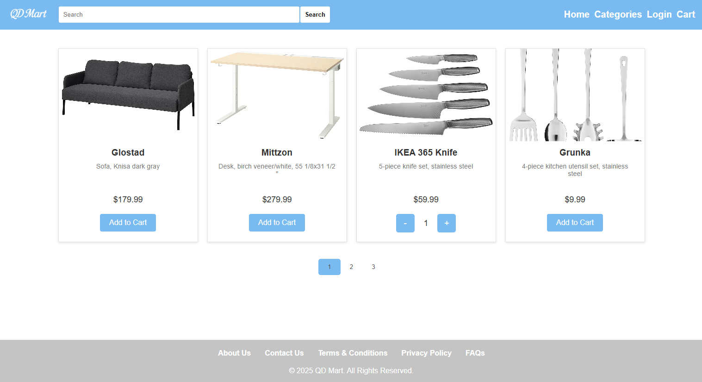

### Category Page

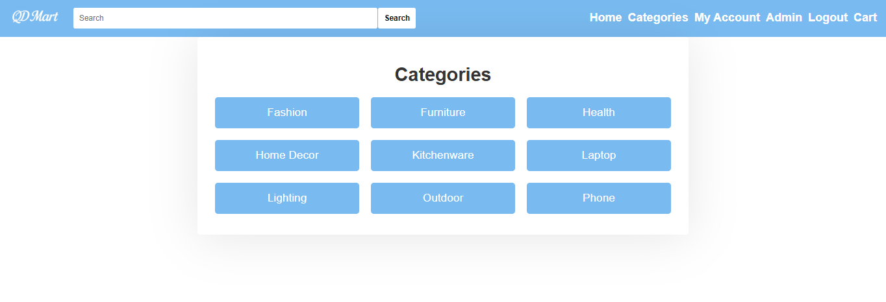

### Register Page

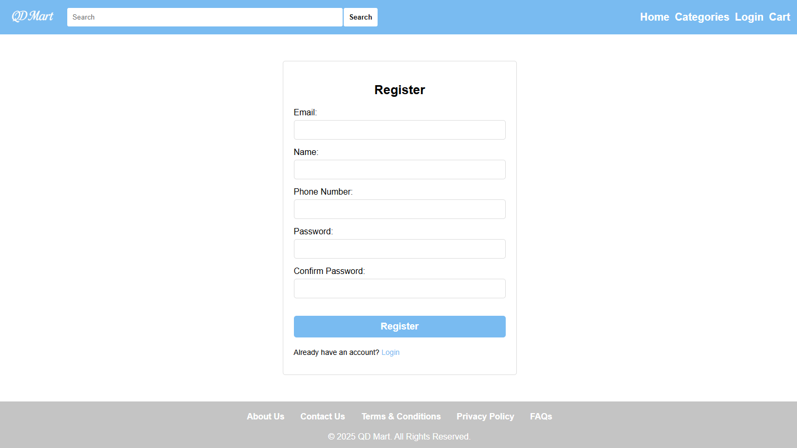

### Login Page

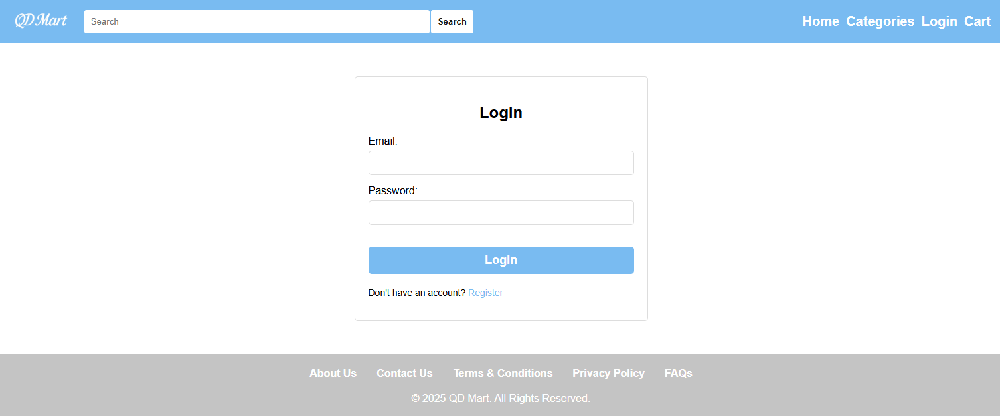

### User Profile

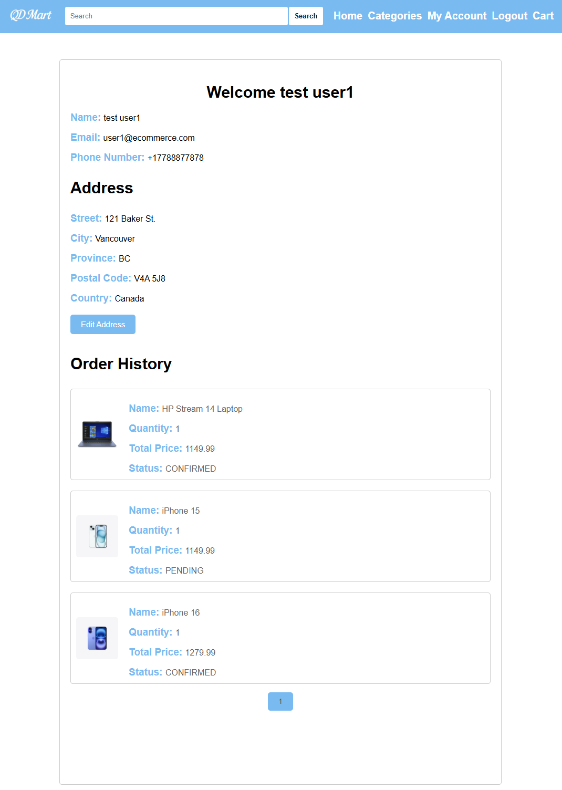

### Cart Page

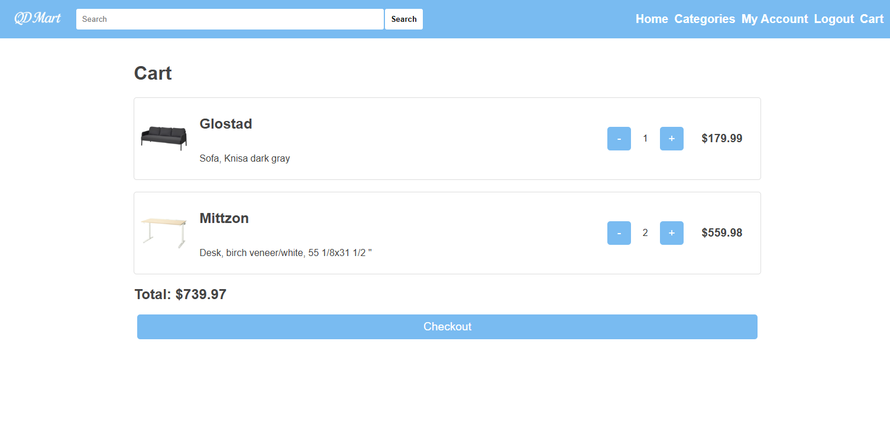

### Admin Page

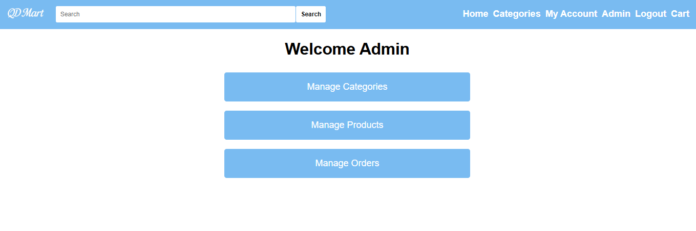

### Admin Category Page

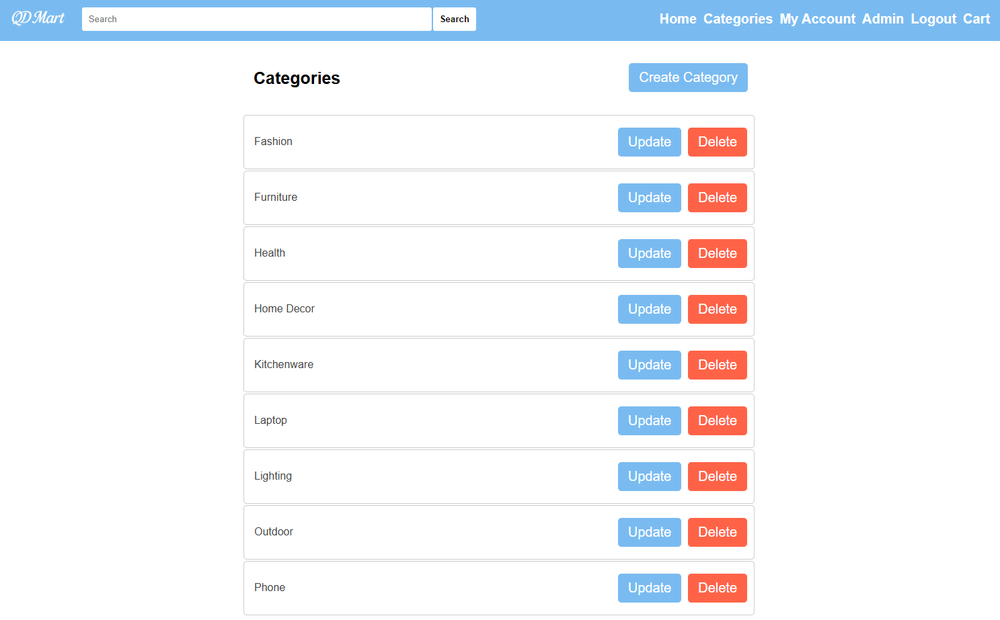

### Admin Category Update

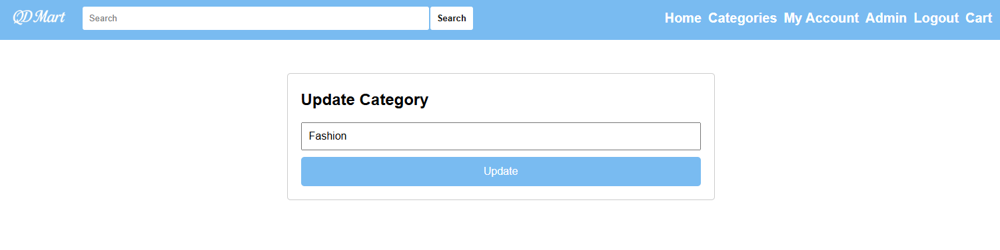

### Admin Product Page

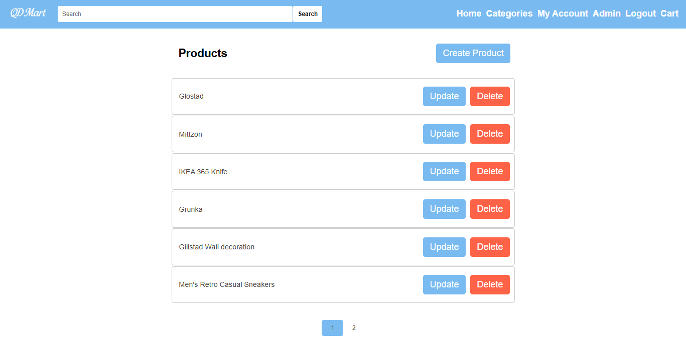

### Admin Product Update Page

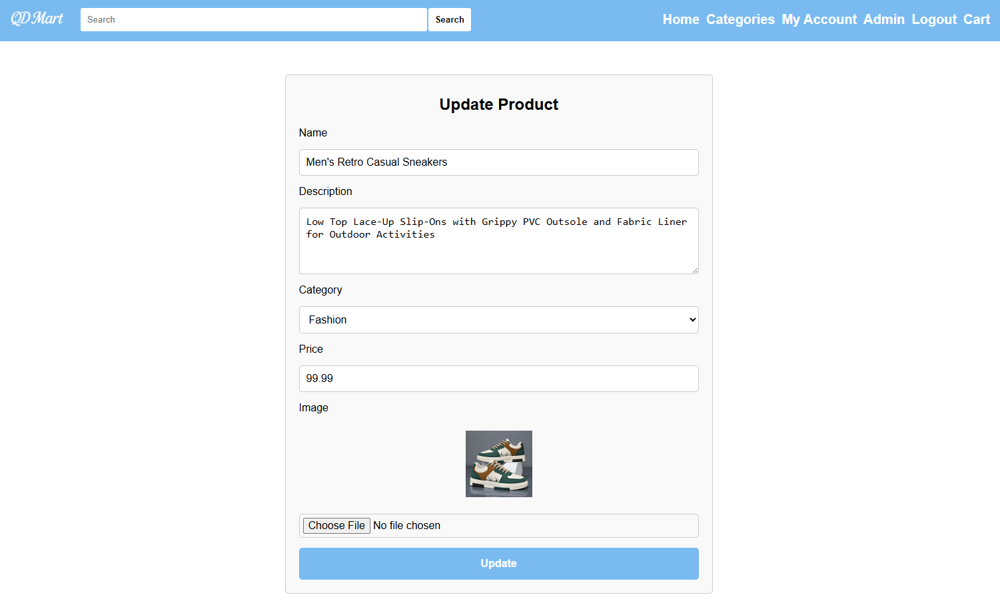

### Admin Order Page

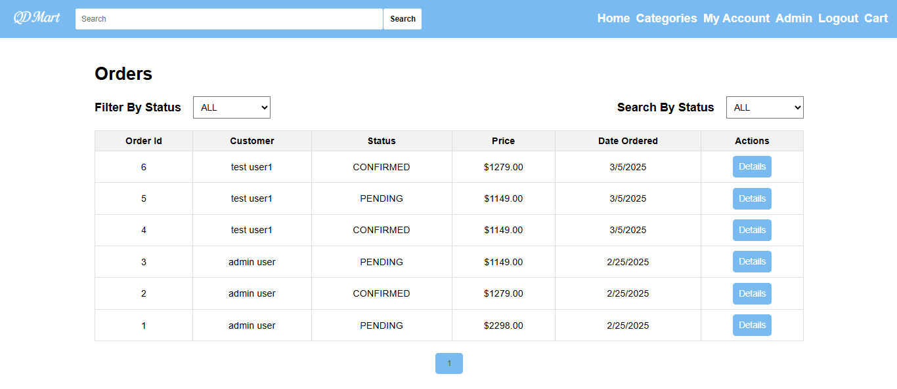

### Admin Order Status Update Page

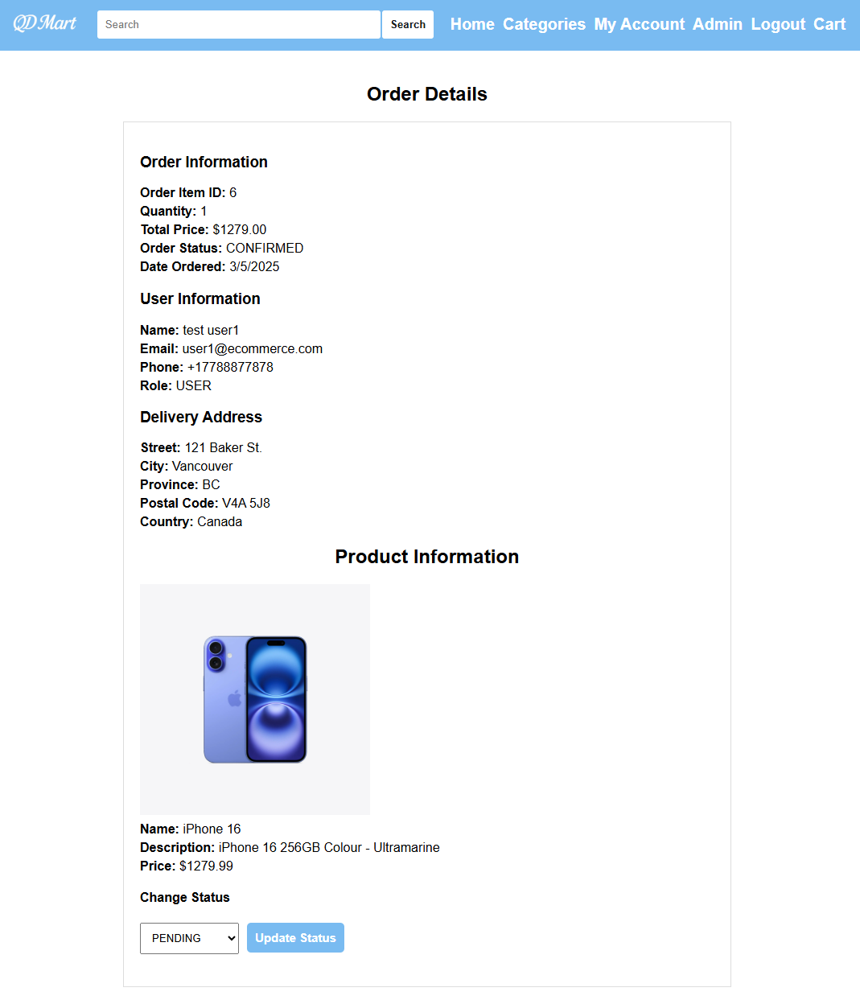

### Responsive design

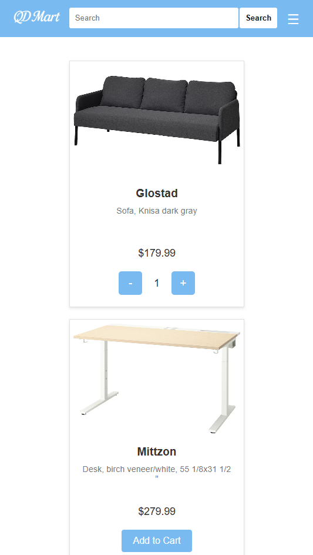

## Contributing

As the project is complete, contributions are optional but welcomed for improvements or bug fixes.

## License

This project is licensed under the MIT License. See the [LICENSE](LICENSE) file for details.
